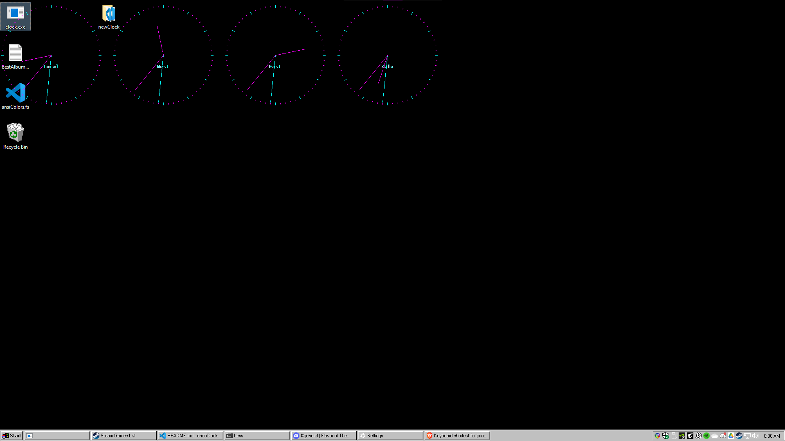
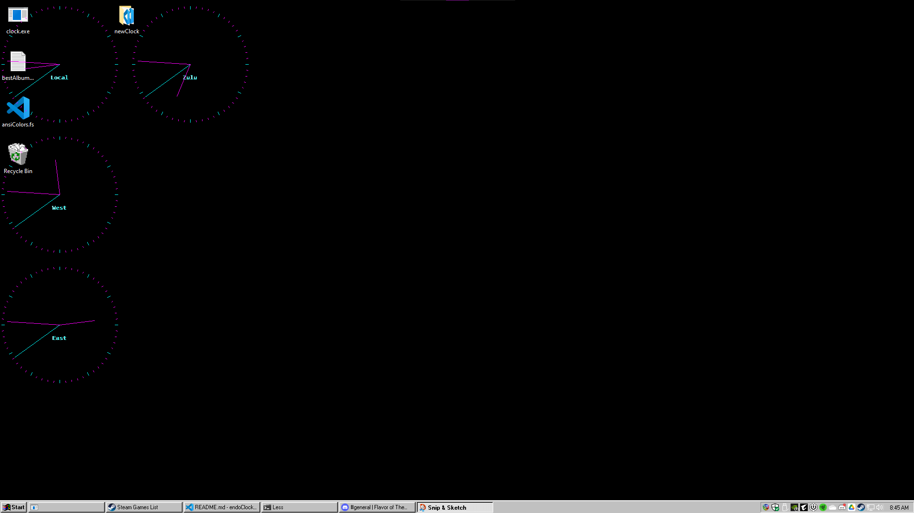
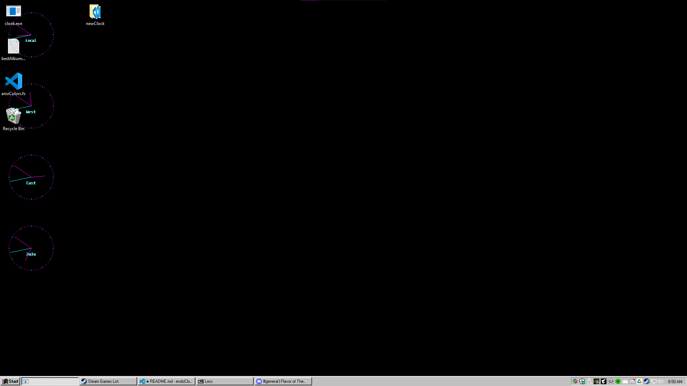
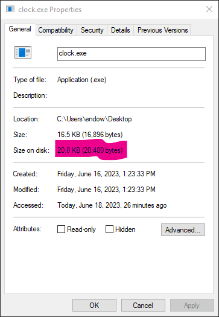
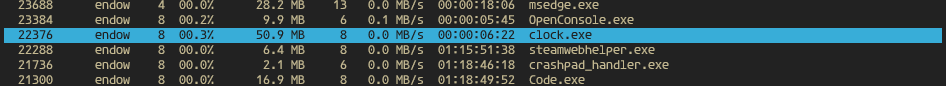

# endoClock
 A lightweight, customizable,  many analog clock WinForms layout, for any Windows 10 system.

endoClock is very lightweight, has a minimal footprint, and barely uses memory.
It can display customizable analog clocks from many timezones ontop of your screen.

## Installation

### Windows 10

1. Clone or download a zip of this source.
For best results, move the project folder to your Desktop.
2. Run `build.cmd`. 
3. On success, run `install.cmd`.
4. Find and run `clock.exe` on your Desktop.
5. Find and edit configuration at `%APPDATA%\endoClock\endoClockConfig.xml`.

### ScreenShots

#### Default Configuration 

Note the clippy-ness (ability to click-thru).

#### Flipped clocks 

Note that the custom grid has moved the fourth clock to the next available column.

#### Smaller! 

Note that when clock size is decreased, the grid automatically moves the clocks back into the first column.

#### On Disk Size

#### Memory Usage

Taken with NTop.

## Runtime Usage

There are several runtime options.

### Show Help

<table>
    <tr>
        <td>Shortcut</td>
        <td><code>F1</code></td>
    </tr>
        <td>Description</td>
        <td>This control will display a help dialog.</td>
    </tr>
    <tr>
        <td>Configuration</td>
        <td>Runtime only</code></td>
    </tr>
    <tr>
        <td>Issues</td>
        <td>Not yet fully implemented 👉👈</code></td>
    </tr> 
</table>

### Increase Tick Thickness

<table>
    <tr>
        <td>Shortcut</td>
        <td><code>Ctrl + .</code></td>
    </tr>
        <td>Description</td>
        <td>Increases the size of minute and hour ticks as well as all clock hands.</td>
    </tr>
    <tr>
        <td>Issues</td>
        <td>❗ Not currently index checked; could throw an exception on extremes.</td>
    </tr>
</table>

### Decrease Tick Thickness

<table>
    <tr>
        <td>Shortcut</td>
        <td><code>Ctrl + ,</code></td>
    </tr>
        <td>Description</td>
        <td>Decreases the size of minute and hour ticks as well as all clock hands.</td>
    </tr>
    <tr>
        <td>Issues</td>
        <td>❗ Not currently index checked; could throw an exception on extremes.</td>
    </tr>
</table>

### Decrease Font Size

<table>
    <tr>
        <td>Shortcut</td>
        <td><code>Ctrl + [</code></td>
    </tr>
        <td>Description</td>
        <td>Decreases the size of all text.</td>
    </tr>
    <tr>
        <td>Issues</td>
        <td>❗ Not currently index checked; could throw an exception on extremes.</td>
    </tr>
</table> 

### Increase Font Size

<table>
    <tr>
        <td>Shortcut</td>
        <td><code>Ctrl + ]</code></td>
    </tr>
        <td>Description</td>
        <td>Increases the size of all text.</td>
    </tr>
    <tr>
        <td>Issues</td>
        <td>❗ Not currently index checked; could throw an exception on extremes.</td>
    </tr>
</table> 

### Toggle Clock Label

<table>
    <tr>
        <td>Shortcut</td>
        <td><code>Ctrl + H</code></td>
    </tr>
        <td>Description</td>
        <td>This control will show or hide each analog clock label.</td>
    </tr>
</table>

### Toggle Clock Face

<table>
    <tr>
        <td>Shortcut</td>
        <td><code>Ctrl + F</code></td>
    </tr>
        <td>Description</td>
        <td>This control will show or hide each analog clock face plate.</td>
    </tr>
</table>

### Increase Clock Size

<table>
    <tr>
        <td>Shortcut</td>
        <td><code>Ctrl + =</code></td>
    </tr>
        <td>Description</td>
        <td>This control will increase the size of each clock.</td>
    </tr>
</table>

### Increase Clock Size

<table>
    <tr>
        <td>Shortcut</td>
        <td><code>Ctrl + -</code></td>
    </tr>
        <td>Description</td>
        <td>This control will decrease the size of each clock.</td>
    </tr>
</table>

### Toggle Form Border

<table>
    <tr>
        <td>Shortcut</td>
        <td><code>F11</code></td>
    </tr>
        <td>Description</td>
        <td>This control enables the window border and background for user interaction.</td>
    </tr>
</table>

### Hot Reload

<table>
    <tr>
        <td>Shortcut</td>
        <td><code>Alt + R</code></td>
    </tr>
        <td>Description</td>
        <td>This control reloads the configuration file and redraws the clock layer.</td>
    </tr>
</table>

### Exit

<table>
    <tr>
        <td>Shortcut</td>
        <td><code>Ctrl + Q</code></td> 
        <td><code>Ctrl + X</code></td>
    </tr>
    <tr>
        <td>Description</td>
        <td colspan="2">This control exits the application.</td>
    </tr>
</table>

### Toggle Fill Direction

<table>
    <tr>
        <td>Shortcut</td>
        <td><code>Alt + F</code></td>
    </tr>
        <td>Description</td>
        <td>This control will change the fill direction between  <code>LeftToRight</code> and <code>TopToBottom</code>.</td>
    </tr>
</table>

## Configuration Options

On first run, a default configuration file will be saved at `%APPDATA`\endoClock\endoClockConfig.xml`.
All options are stored as strings.

### ClockDataCollection

The top level. Holds `ClockData`.

### Clock Data

Represents a single clock.
Each `ClockData` entity represents one clock.

<table>
    <th>
        <td>Option Name</td>
        <td>Description</td>
        <td>Valid Options</td> 
    </th>
    <tr>
        <td>Label</td>
        <td>This is the clocks name.</td>
        <td>Any valid string.</td>
    </tr>
    <tr>
        <td>TimeZoneId</td>
        <td>The time zone identifier string for the clock's timezone.</td>
        <td><a href="https://learn.microsoft.com/en-us/windows-hardware/manufacture/desktop/default-time-zones?view=windows-11">Microsoft System Time Zones</a></td> 
    </tr>
    <tr>
        <td>Colors</td>
        <td>A child element that stores color configuration for each clock.</td>
        <td>
            <ul>
                <li>HourHand</li>
                <li>MinuteHand</li>
                <li>SecondHand</li>
                <li>Face</li>
                <li>HourTick</li>
                <li>MinuteTick</li>
                <li>Text</li>
            </ul>
        </td>
    </tr>
    <tr>
        <td>FaceFont</td>
        <td>The font face for the clock label.</td>
        <td>Any installed Font Family name.</td>
    </tr>
    <tr>
        <td>ShowMinuteTicks</td>
        <td>Draw minute ticks on this clock.</td>
        <td><code>true</code> or <code>false</code></td>
    </td>
    <tr>
        <td>ShowHourTicks</td>
        <td>Draw hour ticks on this clock.</td>
        <td><code>true</code> or <code>false</code></td>
    </td>
    <tr>
        <td>ShowLabel</td>
        <td>Draw the name on this clock.</td>
        <td><code>true</code> or <code>false</code></td>
    </td> 
</table>

### Colors

Holds the color configuration for each clock.
[Html Colors](https://www.w3schools.com/colors/colors_names.asp) are valid strings to include hex tags, _e.g_, `#DAA520`.

<table>
    <th>
        <td>Option</td>
        <td>Description</td>
    </th>
    <tr>
        <td>HourHand</td>
        <td>The color of the hour hand.</td>
    </tr> 
    <tr>
        <td>MinuteHand</td>
        <td>The color of the minute hand.</td>
    </tr> 
    <tr>
        <td>SecondHand</td>
        <td>The color of the second hand.</td>
    </tr> 
    <tr>
        <td>Face</td>
        <td>The color of the clock face plate.</td>
    </tr> 
    <tr>
        <td>HourTick</td>
        <td>The color of the hour ticks on the clock face.</td>
    </tr> 
    <tr>
        <td>MinuteTick</td>
        <td>The color of the minute ticks on the clock face.</td>
    </tr> 
    <tr>
        <td>Text</td>
        <td>The color of the clock label.</td>
    </tr>
</table>
